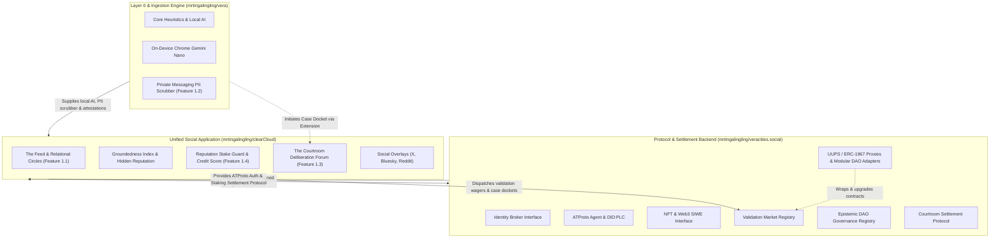

# ⚖️ veracities.social · Protocol & Settlement Backend

> Headless Identity Broker, Validation Market Staking Registry, Epistemic DAO ("EnDAOsment"), and Courtroom Settlement Protocol for the Vera ecosystem.

---

## 🏗️ Architecture Blueprint

`veracities.social` provides the decentralized protocol and settlement backend powering the user-facing social application ([`mrtingalingling/clearCloud`](https://github.com/mrtingalingling/clearCloud)) and consuming on-device local AI from [`mrtingalingling/vera`](https://github.com/mrtingalingling/vera):



Detailed specification available in [**`docs/architecture.md`**](./docs/architecture.md).

---

## 🌟 Protocol Subsystems

1. **Identity Broker Subsystem (`src/identity/`)**:
   - ATProto (`@atproto/api` BskyAgent, `did:plc` resolution, custom `social.veracities.*` lexicons).
   - Web3 SIWE (EIP-4361 cryptographic challenge signing, W3C `did:pkh` resolution, `siweLink.js`).
2. **Validation Market Subsystem (`src/market/`)**:
   - Prediction market staking pools, dynamic odds, and automated settlement across Vera's 4 epistemic outcomes (`VERIFIED`, `DISPUTED`, `MISINFORMED`, `NEED_CONTEXT`).
   - 4-Stage Poker Evidence Wagering Rounds (`Pre-Flop`, `Evidence Drop`, `Cross-Exam`, `Showdown`) with loss-mitigation `Fold` actions.
   - Truth Parleys Ticket Builder with compounded payout multiplier calculation.
   - Epistemic Put & Call derivative hedge options for downside protection and conviction leverage.
   - Losing stake slashing waterfall: **15% Whistleblower Bounty**, **5% Juror Deliberation Fee**, **5% Protocol Fee**.
3. **Epistemic DAO Subsystem ("EnDAOsment") (`src/governance/`)**:
   - Multi-dimensional Epistemic Quotient ($EQ$) formula based on Factuality, Bridging, Steel-Manning, and Toxicity penalty.
   - Quadratic tier voting multipliers (Novice: 1, Contributor: 5, Arbiter: 15, Sage Elder: 30).
   - Zero-Knowledge Semaphore identity bridge (`zkSemaphoreBridge.js`) and client-side anonymous voting with single-use nullifiers.
4. **Courtroom Settlement & Oracles (`src/settlement/`, `src/oracle/`)**:
   - 14-day cold case refund distribution (**94% refunded**, **6% protocol fee** retained).
   - Challenge bond retrial escrow (50% bounty reward for overturned verdicts).
   - $M$-of-$N$ EIP-712 threshold multi-signature citizen oracle relayer (`oracleRelayer.js`).
5. **EVM Smart Contracts (`contracts/`)**:
   - `ValidationMarket.sol`: UUPS / ERC-1967 upgradeable prediction market, dynamic domain separator, slashing waterfall, and EIP-712 settlement.
   - `CourtroomEscrow.sol`: UUPS / ERC-1967 upgradeable 14-day cold case escrow refunds and retrial bonds.
   - `EpistemicGovernor.sol`: UUPS / ERC-1967 upgradeable Semaphore ZK anonymous governance with quadratic tier weights and modular DAO framework interoperability (OpenZeppelin Governor, Gnosis Safe / Zodiac, Aragon OSx).
   - `proxy/`: Canonical ERC-1967 delegating proxy (`ERC1967Proxy.sol`), initialization guard (`Initializable.sol`), and UUPS upgrade mechanism (`UUPSUpgradeable.sol`).
   - Compiled with Solc 0.8.20 optimizer (200 runs), artifacts exported to `src/config/contracts.json`.
6. **Interactive Svelte 5 Interface**:
   - Dedicated navigation tabs: `MARKETS` (`MarketView.svelte`), `ESCROW` (`EscrowSettlementView.svelte`), `ORACLE` (`OracleAttestationView.svelte`), and `GOVERNANCE` (`GovernanceView.svelte` with Proxy & Framework cockpit).

---

## 🚀 Quickstart & Testing

```bash
npm install
npm test # Runs 95/95 passing Vitest tests across 16 suites
npm run compile:contracts # Compiles Solidity contracts via Solc optimizer
npm run dev # Starts local Svelte 5 dev server on port 5174
```

Detailed architectural specifications, caveats, and deployment runbooks are documented in [**`docs/architecture.md`**](./docs/architecture.md) and canonical [**`vera/docs/ARCHITECTURE_CAVEATS_AND_ROADMAP.md`**](../vera/docs/ARCHITECTURE_CAVEATS_AND_ROADMAP.md).
