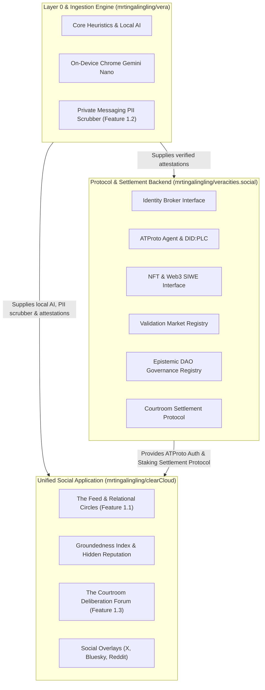

# ⚖️ veracities.social · Protocol & Settlement Backend

> Headless Identity Broker, Validation Market Staking Registry, Epistemic DAO ("EnDAOsment"), and Courtroom Settlement Protocol for the Vera ecosystem.

---

## 🏗️ Architecture Blueprint

`veracities.social` provides the decentralized protocol and settlement backend powering the user-facing social application ([`mrtingalingling/clearCloud`](https://github.com/mrtingalingling/clearCloud)) and consuming on-device local AI from [`mrtingalingling/vera`](https://github.com/mrtingalingling/vera):



Detailed specification available in [**`docs/architecture.md`**](./docs/architecture.md).

---

## 🌟 Protocol Subsystems

1. **Identity Broker Subsystem (`src/identity/`)**:
   - ATProto (`@atproto/api` BskyAgent, `did:plc` resolution, session verification).
   - Web3 SIWE (EIP-4361, W3C `did:pkh` resolution, ERC-721 token gating placeholder).
2. **Validation Market Subsystem (`src/market/`)**:
   - Prediction market staking pools, dynamic odds, and automated settlement across Vera's 4 epistemic outcomes (`VERIFIED`, `DISPUTED`, `MISINFORMED`, `NEED_CONTEXT`).
3. **Epistemic DAO Registry Subsystem ("EnDAOsment") (`src/governance/`)**:
   - Proposal creation, weighted voting, and quorum/consensus evaluation.
4. **Courtroom Settlement Protocol (`src/settlement/`)**:
   - 14-day cold case refund distribution (**94% refunded**, **6% protocol fee** retained).
   - Challenge bond retrial escrow (50% bounty reward for overturned verdicts).
   - Decisive jury consensus tallying (66.7% threshold).

---

## 🚀 Quickstart & Testing

```bash
npm install
npm test
```
