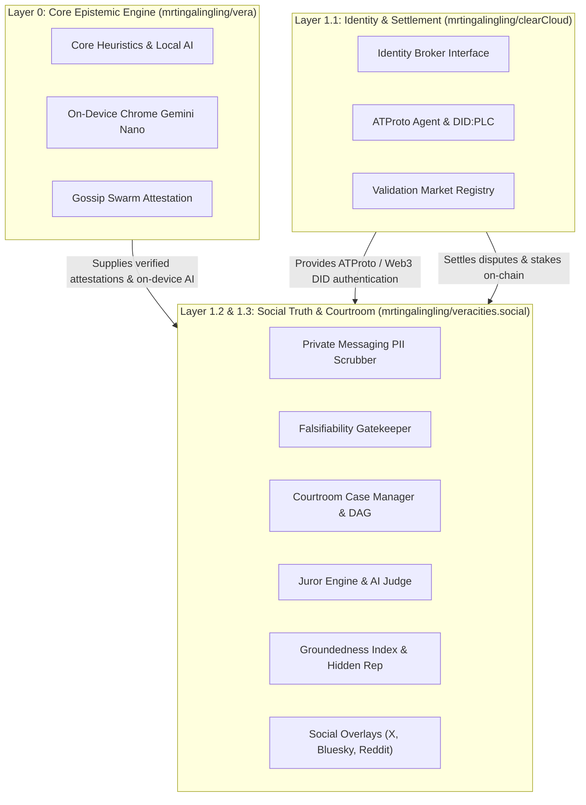

# 🏛️ veracities.social · Layer 1.2 & 1.3 Courtroom & Social Truth Suite

> Private Messaging PII Scrubber (WhatsApp/Telegram), The Courtroom adversarial truth deliberation docket, and Social Truth Overlays (Bluesky, X, Reddit) for the Vera ecosystem.

---

## 🏗️ Multi-Repository Architecture Blueprint

`veracities.social` consumes Layer 0 (`mrtingalingling/vera`) for epistemic heuristics and Layer 1.1 (`mrtingalingling/clearCloud`) for ATProto identity and validation market settlement:



Detailed specification available in [**`docs/architecture.md`**](./docs/architecture.md).

---

## 🌟 Key Capabilities

### 1. Layer 1.2: Private Messaging Add-on (`src/messaging/`)
- **Zero-Knowledge PII Scrubber**: Cleanses names, emails, phone numbers, handles, and financial IDs directly on-device.
- **Core Claim Extractor**: Strips hearsay, gossip preambles, and conversational pleasantries.
- **Explicit Opt-In Guard**: Ensures zero data leaves the user's browser without explicit verification approval.

### 2. Layer 1.3: The Courtroom (`src/courtroom/`)
- **Falsifiability Gatekeeper**: Strictly admits testable claims; rejects unprovable subjective/aesthetic statements.
- **Compound Claim DAG Decomposition**: Automatically breaks compound assertions into Directed Acyclic Graphs of sub-claims.
- **14-Day Stale Cold Case Refund**: Inactive cases refund **94% of wagers**, retaining a **6% protocol maintenance fee**.
- **Challenge Bond Retrial / Appeals**: Allows cases to be reopened when fresh evidence emerges.
- **Anonymous Jury & AI Judge**: Stake-weighted community jury voting paired with neutral AI judicial summaries.

### 3. Layer 1: Social Truth Suite (`src/social/`)
- **Groundedness Index ($G$)**: Algorithmic ranking emphasizing verifiable facts and penalizing debunked claims ($3\times$ weight).
- **Asymmetric Hidden Reputation**: Protects feeds against rage-bait with severe penalties and gradual accrual.
- **Social Overlays**: Generates embedded cards with Vera's 4 epistemic badges (`verified`, `disputed`, `misinformed`, `need-additional-context`) for Bluesky, X, Reddit, and YouTube.

---

## 🚀 Quickstart & Testing

```bash
# Install dependencies
npm install

# Run Vitest test suite (18 unit & integration tests)
npm test
```

---

## 🔗 Cross-Repository Interoperability

```javascript
import { piiScrubber, caseManager, overlayService } from 'veracities-social';
import { analyzeClaimLocally } from '@vera/core';
import { createAuthProvider, ValidationMarket } from 'clearcloud';

// 1. Scrub PII from private message
const preview = piiScrubber.createVerificationPreview(rawMessage);
preview.isApproved = true;

// 2. Local AI claim analysis via Vera Layer 0
const analysis = await piiScrubber.confirmAndVerify(preview, analyzeClaimLocally);

// 3. Authenticate with ATProto via clearCloud Layer 1.1
const auth = createAuthProvider('atproto');
const session = await auth.authenticate({ identifier: 'user.bsky.social', password: 'app-password' });

// 4. Docket in Courtroom Layer 1.3
const docketedCase = caseManager.openCase({
  title: 'Investigative Case',
  claimText: preview.coreClaim,
  creatorDid: session.did
});

// 5. Generate Bluesky feed overlay card
const overlay = overlayService.createOverlayCard({
  platform: 'bluesky',
  postId: 'at://did:plc:.../app.bsky.feed.post/123',
  postText: preview.coreClaim,
  analysis
});
```
