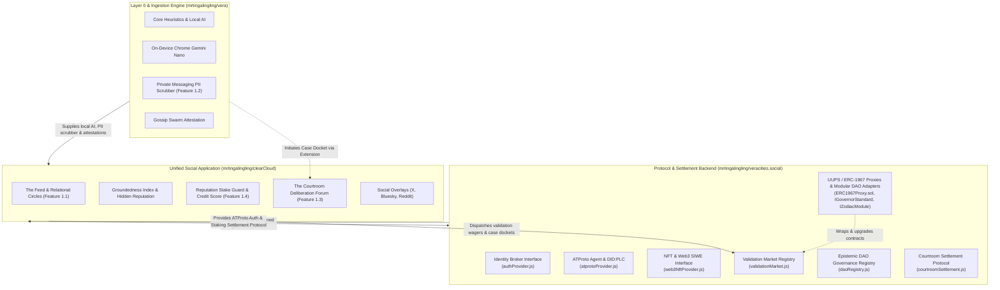

# veracities.social Architecture Blueprint (Protocol & Settlement Backend)

## 1. Overview in the Vera Ecosystem

`veracities.social` serves as the **headless Protocol & Settlement Backend** of the Vera decentralized truth network. It provides identity broking, truth prediction staking pools, epistemic DAO governance, and formal courtroom settlement rules.

---

## 2. Core Protocol Subsystems

### 2.1 Identity Subsystem (`src/identity/`)
- **ATProto Provider (`atprotoProvider.js`)**: Real BskyAgent integration, DID:PLC directory resolution, and session management.
- **Web3 NFT Provider (`web3NftProvider.js`)**: EIP-4361 SIWE challenge generation, W3C DID:PKH resolution, and NFT token-gate verification.
- **Unified Factory (`index.js`)**: `createAuthProvider(type, options)`.

### 2.2 Validation Market Subsystem (`src/market/`)
- **Prediction Pools (`validationMarket.js`)**: Staking pools across Vera's 4 epistemic outcomes (`VERIFIED`, `DISPUTED`, `MISINFORMED`, `NEED_CONTEXT`).
- **Dynamic Odds**: Real-time payout odds based on proportional liquidity.
- **Poker Evidence Wagering**: 4 distinct rounds (`Pre-Flop`, `Evidence Drop`, `Cross-Exam`, `Showdown`) with loss-mitigating `Fold` actions.
- **Truth Parleys & Derivatives**: Multi-claim compounded ticket multiplier and Epistemic Put/Call derivative hedge options.
- **Slashing Waterfall**: 15% Whistleblower Evidence Bounty, 5% Juror Deliberation Fee, 5% Protocol Fee.

### 2.3 Epistemic DAO Registry Subsystem ("EnDAOsment") (`src/governance/`)
- **DAO Registry (`daoRegistry.js`)**: Multi-dimensional Epistemic Quotient ($EQ$) formula, quadratic tier multipliers (1, 5, 15, 30), and two-stage proposal consensus (Stage 1 Approval + Stage 2 Quadratic Voting with individual credit budgets: $V = \lfloor\sqrt{C}\rfloor$).
- **Semaphore ZK Identity Bridge (`zkSemaphoreBridge.js`)**: Anonymous quadratic voting using Semaphore zero-knowledge proofs and single-use nullifiers.
- **EnDAOsment Framework Adapter**: Dispatches execution payloads to EnDAOsment's `GovernorGeneral` and `TimelockController`.

#### 2.3.1 How We Leverage the EnDAOsment Framework
1. **Checkpointed Epistemic CRS**: `EpistemicCrsManager.sol` implements `ICrsManager` using OpenZeppelin `Checkpoints.Trace208`, mapping Epistemic Tiers (Novice: 100, Contributor: 500, Arbiter: 1,500, Sage Elder: 3,000) to historical block-level snapshots. This eliminates flash-loan / flash-reputation exploits.
2. **Two-Stage Deliberation Pipeline**:
   - **Stage 1 (Epistemic Approval)**: Qualitative truth and platform safety vetting by high-tier Sages and Arbiters via `ApprovalGovernor.sol`.
   - **Stage 2 (Quadratic Voting)**: Resource allocation and rule changes where citizen votes scale quadratically as $V = \lfloor\sqrt{C}\rfloor$ ($C = V^2$) from credit budgets.
3. **Safe Timelock Execution**: Succeeded proposals queue into `TimelockControllerUpgradeable` with a 24–48h delay for transparent community review prior to execution.
4. **ZK Anonymous Bridge**: Voters generate client-side Semaphore ZK proofs to cast ballots without revealing their DIDs, with `EpistemicGovernor.sol` relaying finalized execution payloads.

#### 2.3.2 What Happens if the Framework Updates
1. **Zero Data Loss via UUPS Storage Decoupling**: All contracts run behind independent ERC-1967 proxies with reserved storage gaps (`uint256[45..48] private __gap;`). Upgrading framework implementations does not affect or erase member badges, proposal records, or CRS checkpoints.
2. **Interface Compatibility & Dynamic Reconfiguration**: Non-breaking framework updates require zero adjustments. Breaking interface changes can be dynamically reconfigured via `configureParentDAO(ParentFramework.ENDAOSMENT, newAddress)` or adapted via a zero-downtime UUPS proxy upgrade on `EpistemicGovernor.sol`.
3. **Autonomous Reputation Heuristics**: The Epistemic Quotient ($EQ$) formula lives strictly inside Vera's `EpistemicCrsManager.sol`. Framework updates cannot alter Vera's reputation scoring.
4. **Modular Fallback**: If the framework pauses or fails, `EpistemicGovernor.sol` falls back to standalone execution or alternative adapters (OpenZeppelin, Gnosis Safe Zodiac, Aragon OSx).

### 2.4 Courtroom Settlement & Oracle Relayer (`src/settlement/`, `src/oracle/`)
- **Cold Case Escrow (`courtroomSettlement.js`)**: Automatic 14-day inactivity settlement (**94% refunded** to depositors, **6% platform maintenance fee** retained).
- **Challenge Bond Escrow**: Anti-spam staking mechanism for retrials (overturned verdicts award bond + 50% bounty; reaffirmed verdicts forfeit bond).
- **Threshold Oracle Relayer (`oracleRelayer.js`)**: Verifies $M$-of-$N$ EIP-712 citizen juror signatures and single-use nonces against sortition rosters before triggering on-chain market settlement.

### 2.5 Production EVM Smart Contracts (`contracts/`)
- **`ValidationMarket.sol`**: UUPS / ERC-1967 upgradeable prediction market managing pools, dynamic odds, dynamic EIP-712 domain separator, losing pool slashing waterfall, and settlement.
- **`CourtroomEscrow.sol`**: UUPS / ERC-1967 upgradeable escrow governing 14-day cold case refunds (94%/6%) and challenge retrial bonds.
- **`EpistemicGovernor.sol`**: UUPS / ERC-1967 upgradeable quadratic tier-weighted governance contract with Semaphore ZK double-voting prevention and modular DAO framework adapters (OpenZeppelin Governor, Gnosis Safe Zodiac module, Aragon OSx plugin, EnDAOsment GovernorGeneral).
- **`proxy/`**: Canonical `ERC1967Proxy.sol`, `Initializable.sol`, and `UUPSUpgradeable.sol` providing atomic proxy initialization and upgrade authorization.
- Compiled with Solc 0.8.20 optimizer (200 runs), artifacts exported to `src/config/contracts.json`.

---

## 3. Cross-Repository Architectural Invariants

For cross-repository architecture specifications, multi-module connection flows, remaining production caveats, and maintenance guides, consult the authoritative canonical document:
[**`vera/docs/ARCHITECTURE_CAVEATS_AND_ROADMAP.md`**](../../vera/docs/ARCHITECTURE_CAVEATS_AND_ROADMAP.md).
