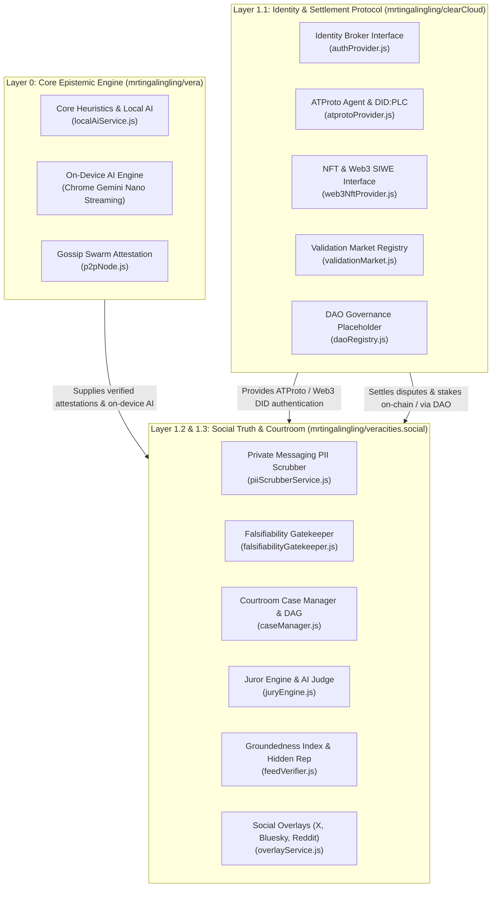

# veracities.social Architecture Blueprint (Layer 1.2 & 1.3)

## 1. Overview in the Vera Ecosystem

`veracities.social` hosts the **Social Truth Suite** and **The Courtroom** of the Vera decentralized truth-settlement network.

---

## 2. Core Modules

### 2.1 Layer 1.2: Private Messaging Add-on (`src/messaging/`)
- **Zero-Knowledge PII Scrubber (`piiScrubberService.js`)**:
  - Runs on-device to scrub emails, phone numbers, social handles, and financial identifiers.
  - Strips gossip preambles and conversational chatter, extracting the core falsifiable claim.
  - Generates a local preview requiring **explicit user confirmation** before any claim leaves the device.

### 2.2 Layer 1.3: The Courtroom (`src/courtroom/`)
- **Falsifiability Gatekeeper (`falsifiabilityGatekeeper.js`)**:
  - Strictly admits testable, measurable, and historical claims.
  - Screens out unprovable subjective claims, aesthetic tastes, and metaphysical beliefs with descriptive tags.
- **Case Manager (`caseManager.js`)**:
  - Dockets cases and decomposes compound claims into Directed Acyclic Graphs (DAGs) of interdependent sub-claims.
  - **14-Day Stale Cold Case Refund**: Inactive cases automatically refund **94% of wagers**, retaining a **6% protocol maintenance fee**.
  - **Challenge Bond Retrial / Appeals**: Allows cases to be reopened when fresh material evidence emerges. Overturned verdicts reward challengers with bounties; reaffirmed verdicts forfeit the bond.
- **Jury & AI Judge Engine (`juryEngine.js`)**:
  - Stake-weighted anonymous juror voting on reasoning rigor and primary documentation.
  - AI Judge acts as a judicial guardrail synthesizing consensus and filtering ad-hominem distortion.

### 2.3 Layer 1: Social Truth Suite (`src/social/`)
- **Groundedness Index ($G$) (`feedVerifier.js`)**:
  $$G = \frac{\text{Facts}}{\text{Facts} + \text{Speculation} + (3 \times \text{Falsehood})}$$
- **Asymmetric Hidden Reputation**:
  - Hidden by default to eliminate vanity gaming.
  - Slow accrual for verified facts; swift, heavy penalties for debunked posts and courtroom slashing.
  - Governs algorithmic distribution across Circle Tiers (Close Friends, Acquaintances, Network-Wide).
- **In-Feed Social Overlays (`overlayService.js`)**:
  - Real-time badge and card formatting for Bluesky, X, Reddit, and YouTube.
