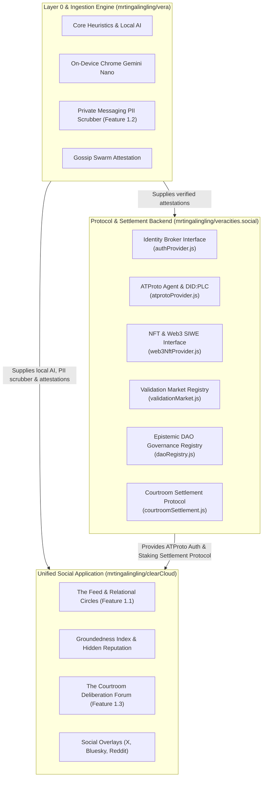

# veracities.social Architecture Blueprint (Protocol & Settlement Backend)

## 1. Overview in the Vera Ecosystem

`veracities.social` serves as the **headless Protocol & Settlement Backend** of the Vera decentralized truth network. It provides identity broking, truth prediction staking pools, epistemic DAO governance, and formal courtroom settlement rules.

---

## 2. Core Protocol Subsystems

### 2.1 Identity Subsystem (`src/identity/`)
- **ATProto Provider (`atprotoProvider.js`)**: Real BskyAgent integration, DID:PLC directory resolution, and session management.
- **Web3 NFT Provider (`web3NftProvider.js`)**: EIP-4361 SIWE challenge generation, W3C DID:PKH resolution, and NFT token-gate verification.
- **Unified Factory (`index.js`)**: `createAuthProvider(type, options)`.

### 2.2 Validation Market Subsystem (`src/market/`)
- **Prediction Pools (`validationMarket.js`)**: Staking pools across Vera's 4 epistemic outcomes (`VERIFIED`, `DISPUTED`, `MISINFORMED`, `NEED_CONTEXT`).
- **Dynamic Odds**: Real-time payout odds based on proportional liquidity.
- **Automated Oracle Settlement**: Payout distribution deducting protocol fees.

### 2.3 Epistemic DAO Registry Subsystem ("EnDAOsment") (`src/governance/`)
- **DAO Registry (`daoRegistry.js`)**: Proposal lifecycles, weighted voting, and quorum/consensus threshold calculation.

### 2.4 Courtroom Settlement Protocol (`src/settlement/`)
- **Cold Case Escrow (`courtroomSettlement.js`)**: Automatic 14-day inactivity settlement (**94% refunded** to depositors, **6% platform maintenance fee** retained).
- **Challenge Bond Escrow**: Anti-spam staking mechanism for retrials (overturned verdicts award bond + 50% bounty; reaffirmed verdicts forfeit bond).
- **Jury Consensus Protocol**: Evaluates 66.7% decisive consensus thresholds.
